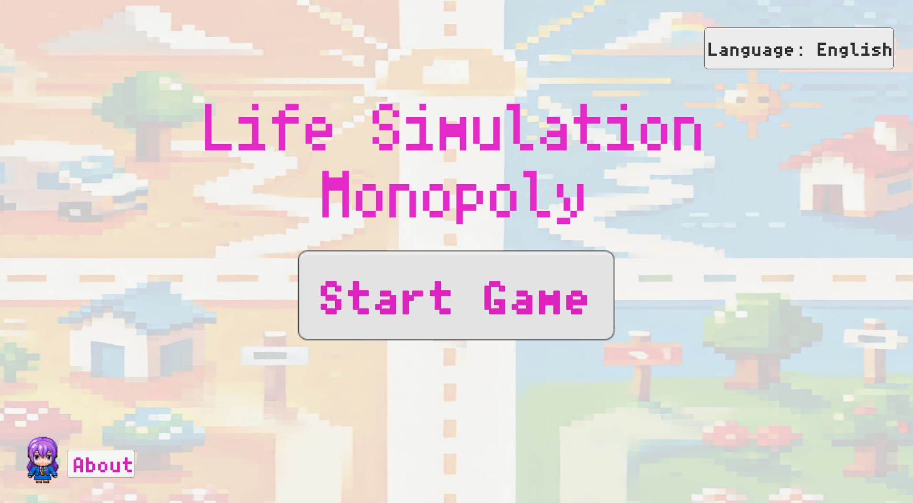
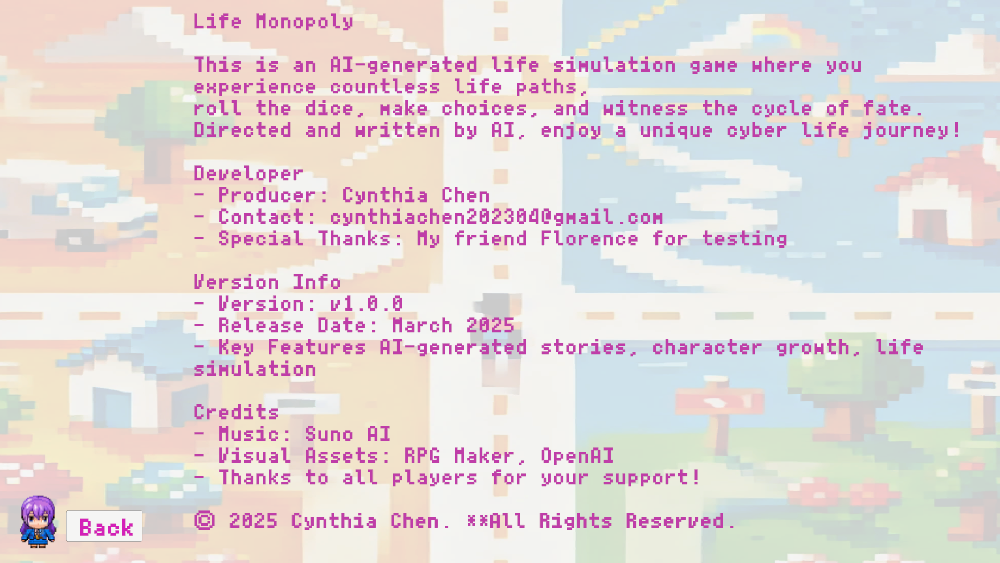
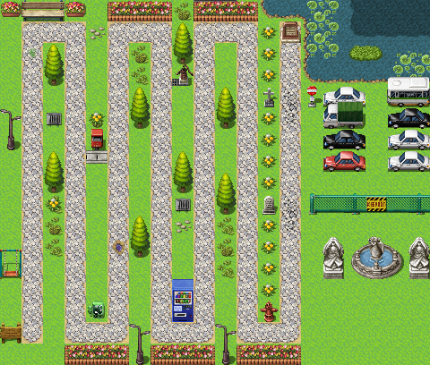
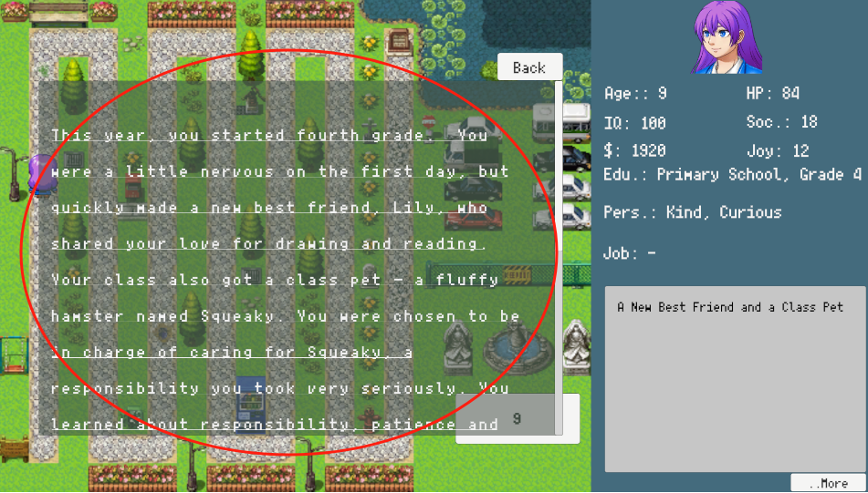
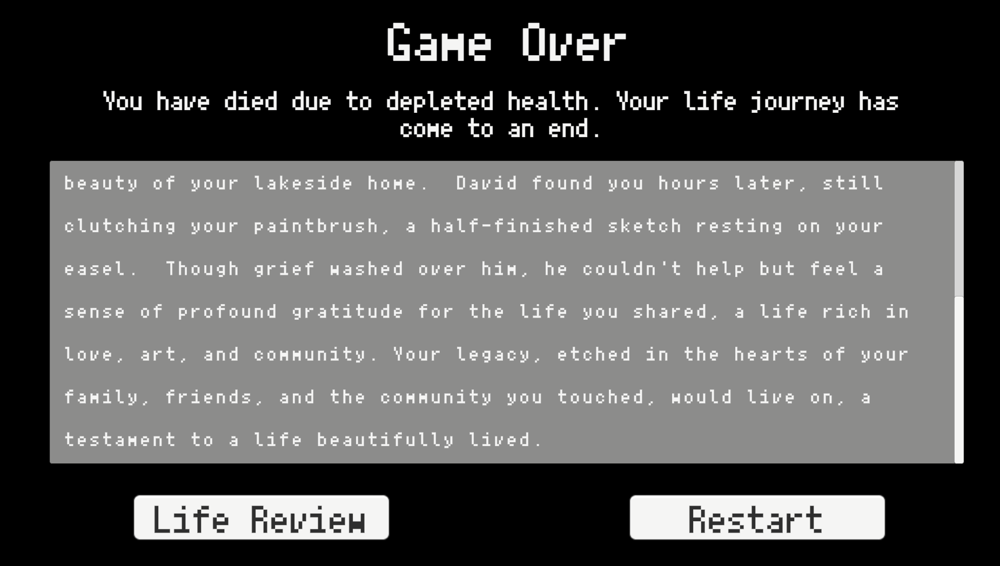
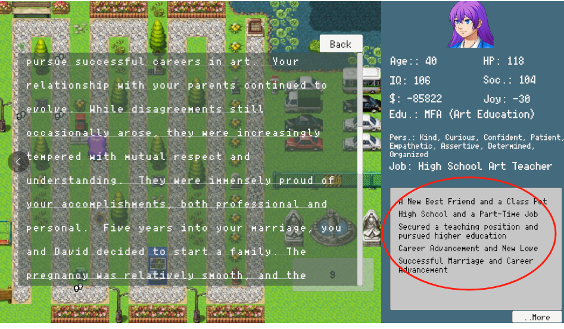
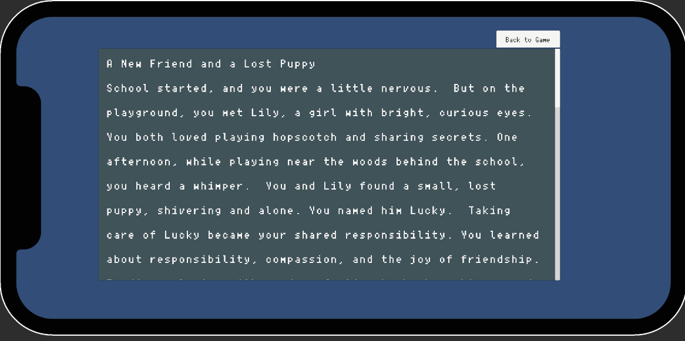
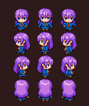
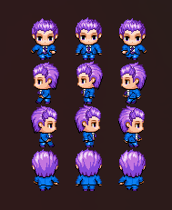
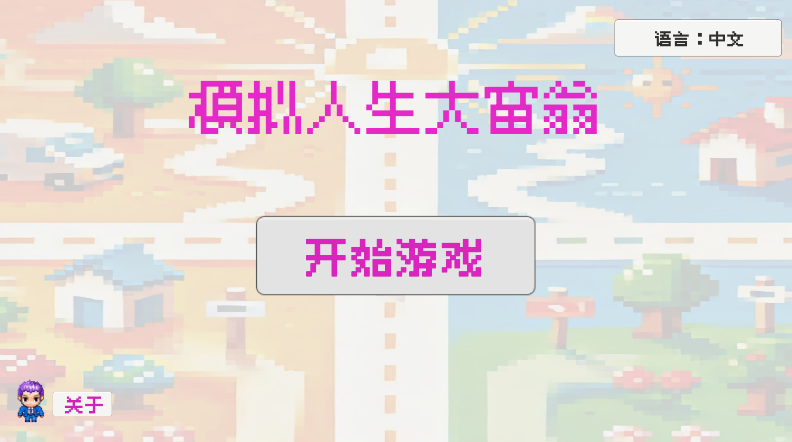

# Monopoly Life Simulation





## Project Description
"Life Simulation Monopoly" is an AI-generated life simulation game demo that combines a Monopoly-style gameplay with AI-generated life events. Players roll the dice to progress through different stages of life, experiencing unique AI-created stories along the way.

Project Inspiration:
While working on an LLM (Large Language Model) project, I became curious about the kinds of life stories an LLM could generate. This led me to develop this demo as an experiment to explore the creativity and limitations of LLMs.

In the initial version, I let the LLM generate all character attributes. However, even with strict constraints in the prompts, it often produced illogical results, such as a 5-year-old CEO or a 100-year-old elementary school student🤦‍♂️.

To address this, I later restricted numerical values while allowing the LLM to focus solely on text generation (such as career, personality, and events). Attributes like wealth, health, and social skills are now controlled by game logic.

In this game, you will experience interesting life stories, which the AI serves as the writer and director, crafting a unique cyber life simulation. However, due to the limitations of the LLM model, some AI-generated stories may be less than perfect. I appreciate your understanding!😆

## Gameplay
1. Click "Start Game", and the character will be randomly assigned a gender and initial attributes.
2. Click "Roll Dice", the character's age will increase by 1-10 years, and they will move forward accordingly.
3. Landing on a tile triggers an AI-generated event, affecting the character's wealth, career, social skills, and more. However, since the game calls the LLM API and waits for a response, there may be a 2-4 second delay😔 before the event text appears. Once the AI-generated content is received, the event window will automatically pop up.


4. A footprint icon will appear where the character lands. Clicking it allows you to review the historical event that occurred at this position.

5. If health drops to 0, the AI will generate a death event, and the game will end.

6. The right-side panel displays the character's current attributes and recent events.



7. Click "..More" to review the full life history of the character.


### Features
1. AI-generated dynamic life events
- LLM generates personality, career, education, and other events
- When health reaches ≤ 0, AI generates a death event
2. Monopoly-style board movement for different life trajectories
3. Randomly generated character attributes
- Gender: Randomly assigned at the start of the game

 




- Age: Increases by 1-10 years per dice roll
- Wealth, social skills, health, and happiness are adjusted randomly
4. Bilingual support (English & Chinese)

5. WebGL compatible—playable directly in a browser
6. Responsive UI for both desktop and mobile devices

Play Online (https://cynthiachen2023.itch.io/life-simulation-monopoly)

**This repository contains:**

The full Unity project (for development & modification), but does not contain WebGL build files (for testing, use the Itch.io link)

## Development Environment
Requirements to run this project:
- Unity Version: 2022.3.4 LTS or later
- WebGL Build Support installed (if building for WebGL)
- Google Gemini API (for AI-generated stories)
- Unity TextMeshPro (for UI components)

## How to Run
Open Project in Unity
```bash
git clone https://github.com/cynthiachen2023/Life-Simulation-Monopoly.git
```
1. Open Unity Hub
2. Click "Open" and select the cloned project folder
3. Wait for Unity to load the project
4. Click "Play" to start the game

## Technical Implementation
### Tech Stack
- C# (Unity): Handles game logic, UI management, and AI generation
- Unity WebGL: Enables browser-based gameplay
- Google Gemini API: AI generates life events, personality traits, and career paths
- RPG Maker: Used for map and player UI design assets
- Suno AI: Generate bgm and theme songs

## Contribution Guide
Contributions are welcome for code improvements, bug fixes, and gameplay enhancements!
If you'd like to contribute:
```BASH
Fork the repository and create a new branch:
git checkout -b feature-branch
git commit -m "Added new feature"
```